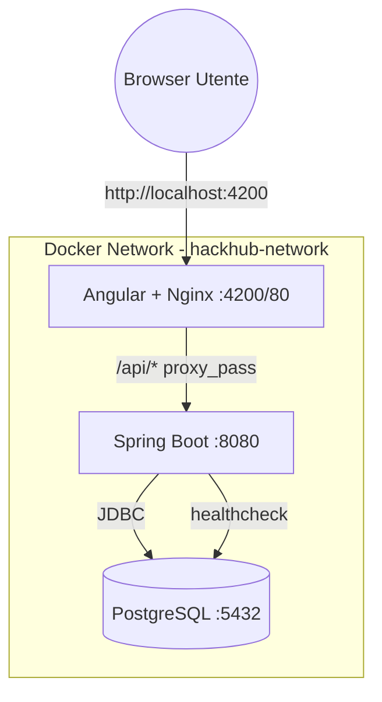
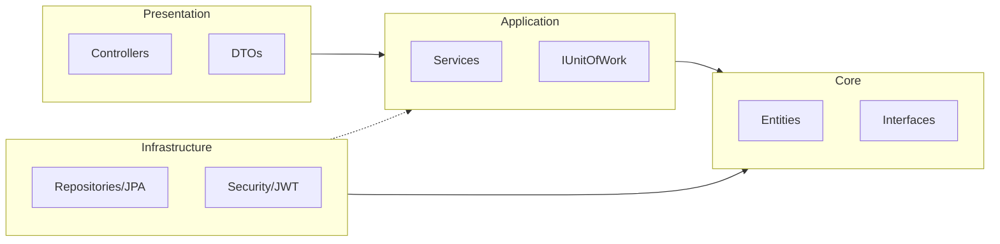

# HackHub

Portale per la gestione di hackathon (utenti, team, iscrizioni, sottomissioni, inviti, richieste di supporto).

## Funzionalità principali

- **Autenticazione**: Registrazione e login con JWT stateless. Ruoli distinti: Organizzatore, Giudice, Mentore, Utente senza team, Leader team, Membro team.
- **Gestione Hackathon**: Creazione, avanzamento automatico degli stati (In Attesa → Iscrizioni → In Corso → Valutazione → Premiazione → Concluso) tramite scheduler.
- **Gestione Team**: Creazione team, inviti via email, accettazione/rifiuto, trasferimento leadership, abbandono team.
- **Iscrizioni**: I team possono iscriversi agli hackathon durante la fase di iscrizioni aperte.
- **Sottomissioni**: I team iscritti possono sottomettere il link GitHub del progetto durante la fase In Corso.
- **Valutazioni**: I giudici assegnati valutano le sottomissioni con voto (0-10) e giudizio testuale.
- **Classifica**: Visualizzazione della classifica finale con i punteggi dei team.
- **Richieste di supporto**: I team possono richiedere supporto ai mentori con proposta di call (Google Meet/Webex).
- **Segnalazioni**: I team possono segnalare problemi all'organizzatore durante l'hackathon.
- **PWA**: Installabile come app nativa, con supporto offline per i contenuti già visitati.

## Architettura del sistema (overview)

```
                Browser
                  |
                  |  http://localhost:4200
                  v
        +---------------------+
        |  Frontend (Angular) |
        |  SPA + proxy /api   |
        +----------+----------+
                   |
                   |  /api/*  (proxy -> backend)
                   v
        +---------------------+          JDBC
        | Backend (Spring)    |--------------------+
        | REST API :8080      |                    |
        | Swagger/OpenAPI     |                    |
        +----------+----------+                    |
                   |                               |
                   | 5432                          |
                   v                               |
        +---------------------+                    |
        | PostgreSQL          |<-------------------+
        | db: hackhub         |
        +---------------------+
```

## Avvio con Docker Compose (Completo)

Il progetto è completamente containerizzato tramite `docker-compose.yml`, che avvia:
- **PostgreSQL**: Database (porta 5432)
- **Backend (Spring Boot)**: API REST (porta 8080)
- **Frontend (Angular)**: Interfaccia utente (porta 4200, servita via Nginx)

### Prerequisiti

- [Docker Desktop](https://www.docker.com/products/docker-desktop/)
- Un file `.env` nella root del progetto (usa `.env.example` come template).

### Configurazione Iniziale
Prima di avviare, crea il tuo file delle variabili d'ambiente:
```bash
cp .env.example .env
```

Il file `.env.example` contiene questi valori di default pronti per lo sviluppo locale:
```env
JWT_SECRET=cambia-questa-chiave-in-produzione-minimo-32-caratteri
JWT_EXPIRATION=86400000
DB_URL=jdbc:postgresql://postgres:5432/hackhub
DB_USERNAME=hackhub
DB_PASSWORD=hackhub
```
Per sviluppo locale i valori di default sono sufficienti. In produzione sostituire almeno JWT_SECRET con una chiave casuale sicura.

### Start/Stop
```bash
# Avvia l'intera stack (compresa la build delle immagini locali)
docker compose up --build -d

# Visualizza lo stato dei container
docker compose ps

# Ferma e rimuovi i container
docker compose down
```

### Credenziali DB (accessibili dal container backend)

- **Host**: `postgres` (o `localhost` per accesso esterno)
- **Port**: `5432`
- **Database**: `hackhub`
- **Username**: `hackhub`
- **Password**: `hackhub`

---

## Sviluppo Locale (Senza Docker)

Se preferisci avviare i servizi separatamente per lo sviluppo:

### Avvio Backend (Spring Boot)
Il backend gira di default su **porta 8080**.
Assicurati di avere un database PostgreSQL attivo (puoi usare `docker compose up postgres -d`).

Da PowerShell:
```bash
cd Codice/app
./mvnw spring-boot:run
```

### Avvio Frontend (Angular)
Il frontend gira su **porta 4200** ed è configurato con proxy verso il backend:
- `Codice/frontend/proxy.conf.json` inoltra `http://localhost:4200/api/*` a `http://localhost:8080/api/*`

```bash
cd Codice/frontend
npm install
npm start
```

## Esecuzione dei Test

### Test Backend (Unit Test)
I test unitari coprono i service principali (AuthService, HackathonService, TeamService) e usano JUnit 5 + Mockito.

```bash
cd Codice/app
./mvnw test
```
Per generare il report di coverage:
```bash
./mvnw verify
```
Il report HTML sarà disponibile in `Codice/app/target/site/jacoco/index.html`.

### Test Frontend
```bash
cd Codice/frontend
npm test
```

## Swagger / OpenAPI

Il backend include `springdoc-openapi`.

- **Swagger UI**: `http://localhost:8080/swagger-ui/index.html`
- **OpenAPI JSON**: `http://localhost:8080/v3/api-docs`

### Esempio credenziali (da registrare)

- **Email**: `test@example.com`
- **Password**: `Test1234!`

Endpoint:
- `POST /api/auth/register`
- `POST /api/auth/login`

## Endpoint REST principali (nomenclatura attuale)

Base path: `http://localhost:8080/api`

### Auth

- `POST /auth/register`
- `POST /auth/login`
- `POST /auth/logout`

### Users

- `GET /users/me`
- `PUT /users/me`
- `GET /users/by-role/{ruolo}` dove `ruolo ∈ {ORGANIZZATORE, GIUDICE, MENTORE}`

### Hackathons

- `GET /hackathons` (pubblici)
- `GET /hackathons/{hackathonId}`
- `POST /hackathons` (creazione)
- `GET /hackathons/my`
- `GET /hackathons/judge/my`
- `GET /hackathons/mentor/my`
- `PATCH /hackathons/{hackathonId}/status`
- `GET /hackathons/{hackathonId}/classifica`
- `GET /hackathons/{hackathonId}/participants`
- `POST /hackathons/{hackathonId}/join?teamId=...`
- `POST /hackathons/{hackathonId}/winner?teamId=...`

### Teams

- `POST /teams`
- `PUT /teams/{teamId}`
- `DELETE /teams/{teamId}/members/me`
- `PATCH /teams/{teamId}/leader/{newLeaderId}`
- `GET /teams/my-teams`
- `GET /teams/{teamId}`
- `POST /teams/cleanup`

### Invitations (inviti)

- `POST /invitations`
- `PATCH /invitations/{id}`
- `GET /invitations/received`
- `GET /invitations/sent`

### Submissions (sottomissioni)

- `POST /submissions`
- `PATCH /submissions/{id}`
- `PATCH /submissions/{id}/evaluation`
- `GET /submissions/my-submissions`
- `GET /submissions/hackathon/{idHackathon}`

### Support requests (richieste supporto)

- `POST /support-requests`
- `GET /support-requests?hackathonId=...`
- `PATCH /support-requests/{id}/call`
- `GET /support-requests/proposte-call?hackathonId=...&teamId=...`

### Segnalazioni

- `POST /segnalazioni`
- `GET /segnalazioni?hackathonId=...`


## Credenziali di prova

Questi utenti vengono inseriti automaticamente dal `DataSeeder` all'avvio se il database è vuoto. La password per tutti gli account è **`Test1234!`**.

| Nome | Email | Ruolo |
| :--- | :--- | :--- |
| Mario Rossi | `mario@hackhub.it` | ORGANIZZATORE |
| Luigi Verdi | `luigi@hackhub.it` | ORGANIZZATORE |
| Giovanni Bianchi | `giudice@hackhub.it` | GIUDICE |
| Paolo Gialli | `mentore@hackhub.it` | MENTORE |
| Francesca Viola | `utente1@hackhub.it` | UTENTE_SENZA_TEAM |
| Matteo Rosso | `utente2@hackhub.it` | UTENTE_SENZA_TEAM |

*Nota: Inserite automaticamente all'avvio se il database è vuoto.*

---

## Scelte progettuali e architetturali

Il progetto HackHub adotta una **Clean Architecture** suddivisa in 4 layer principali:
1. **Core**: Contiene le entità di business (POJO) e le interfacce fondamentali. È il cuore del sistema e non dipende da altri layer.
2. **Application**: Implementa la logica di business, i servizi e le interfacce per i repository (IUnitOfWork).
3. **Infrastructure**: Contiene le implementazioni tecnologiche (JPA, Sicurezza, Database).
4. **Presentation**: Gestisce l'esposizione delle API REST tramite controller Spring Boot.

Questa separazione garantisce testabilità, manutenibilità e indipendenza dai framework esterni.

### Pattern e Tecnologie
- **Unit of Work**: Utilizzato per coordinare il lavoro di più repository e gestire le transazioni in modo atomico, assicurando la consistenza dei dati.
- **Builder Pattern**: Applicato alla creazione degli oggetti `Hackathon`, data la complessità dell'entità e l'elevato numero di campi obbligatori, migliorando la leggibilità e riducendo errori in fase di istanza.
- **Strategy Pattern**: Implementato per la validazione dei link esterni (GitHub, LinkedIn, etc.). Seguendo il principio *Open/Closed*, consente di aggiungere nuove piattaforme di sottomissione senza modificare la logica esistente.
- **JWT Stateless**: Le API sono stateless, aderendo al principio 6 della *12-Factor App*. Questo permette una scalabilità orizzontale ottimale poiché il server non mantiene sessioni locali.
- **BCrypt**: Utilizzato per l'hashing delle password. A differenza di SHA-256, BCrypt include un salt ed è volutamente lento, rendendolo estremamente resistente ad attacchi brute-force e rainbow table.
- **Angular PWA**: Il frontend è una **Progressive Web App**. Include un **Service Worker** per il caching degli asset e delle API, permettendo il caricamento istantaneo e il supporto offline di base.
- **PwaService (SRP)**: La logica per gestire l'installazione dell'app ("Add to Home Screen") è incapsulata in un servizio dedicato, seguendo il Single Responsibility Principle.
- **Angular con TypeScript Strict**: Il frontend utilizza Angular con controlli di tipo rigorosi e **Lazy Loading** per i moduli di feature, ottimizzando i tempi di caricamento iniziali dell'applicazione.
- **PostgreSQL + Docker Compose**: L'intera infrastruttura è containerizzata, garantendo la parità tra gli ambienti di sviluppo, test e produzione (Fattore 10).

---

## Aderenza alla 12-Factor App

| Fattore | Stato | Spiegazione |
| :--- | :---: | :--- |
| I. Codebase | ✅ | Un unico repository GitHub per l'intero progetto HackHub. |
| II. Dependencies | ✅ | Dichiarate esplicitamente in `pom.xml` (Maven) e `package.json` (npm). |
| III. Config | ✅ | Configurazioni caricate da variabili d'ambiente via `.env` e Docker. |
| IV. Backing services | ✅ | PostgreSQL trattato come risorsa esterna collegata tramite JDBC. |
| V. Build, release, run | ✅ | Pipeline CI/CD che separa nettamente la fase di build (immagini) dalla release. |
| VI. Processes | ✅ | Backend stateless grazie all'uso di token JWT. |
| VII. Port binding | ✅ | I servizi espongono le porte 8080 (backend) e 4200/80 (frontend). |
| VIII. Concurrency | ✅ | Gestita tramite istanze multiple di container Docker. |
| IX. Disposability | ✅ | Avvio rapido e arresto pulito grazie alle immagini Docker Alpine. |
| X. Dev/prod parity | ✅ | Identico stack Docker Compose utilizzato in locale e potenzialmente in prod. |
| XI. Logs | ✅ | I log sono trattati come flussi di eventi inviati a stdout/stderr. |
| XII. Admin processes | ✅ | Processi una-tantum (DataSeeder) eseguiti nello stesso ambiente operativo. |
| XIII. API First | ✅ | Interfaccia basata interamente su REST API documentate con Swagger. |
| XIV. Telemetry | ✅ | Implementata tramite Spring Boot Actuator per il monitoraggio. |
| XV. Security | ✅ | Autenticazione JWT e Spring Security a protezione di ogni endpoint. |

---

## Progressive Web App (PWA)

HackHub è installabile come un'applicazione nativa su dispositivi mobile e desktop.
- **Supporto Offline**: Grazie al Service Worker, le parti dell'app già visitate sono accessibili anche senza connessione.
- **Banner di Installazione**: Un banner personalizzato invita l'utente a installare l'app quando i criteri di installabilità sono soddisfatti.
- **Cache intelligente**: Le API sono configurate con strategia *Freshness* (prova a scaricare da rete, se fallisce usa la cache) per garantire dati sempre aggiornati ma accessibili offline.

### Come testare la PWA localmente
Il Service Worker **non è attivo** con `ng serve`. Per testare le funzionalità PWA (installazione e offline):
1.  Genera il build di produzione:
    ```bash
    cd Codice/frontend
    npm run build -- --configuration production
    ```
2.  Avvia un server statico (es. `http-server` o `npx http-server`):
    ```bash
    npx http-server dist/frontend -p 4200
    ```
3.  Apri [http://localhost:4200](http://localhost:4200) in Chrome e verifica in `DevTools -> Application -> Service Workers`.

---

## Diagrammi

### Diagramma di Deploy


### Diagramma architettura backend


---

## Pipeline CI/CD

Il progetto integra una pipeline CI/CD completa tramite **GitHub Actions**:
- **Continuous Integration**: Su ogni push o pull request verso `main`, vengono eseguiti i build Maven (backend) e npm (frontend) per validare il codice.
- **Continuous Deployment**: Al push finale su `main`, la pipeline crea le immagini Docker e le pubblica sul GitHub Container Registry (GHCR).

Configurazione disponibile in: [.github/workflows/ci.yml](.github/workflows/ci.yml)
