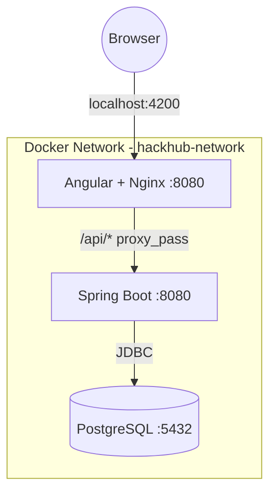
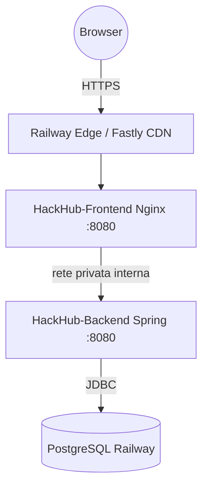
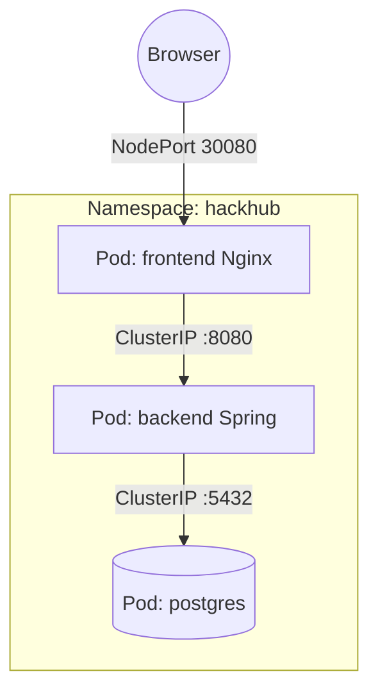
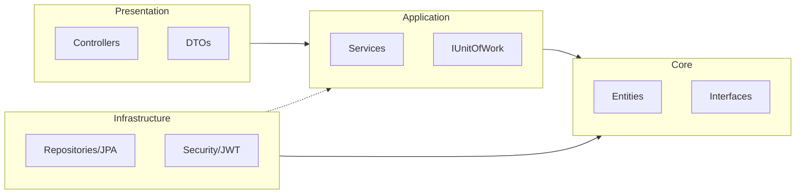

# HackHub

Portale per la gestione di hackathon (utenti, team, iscrizioni, sottomissioni, inviti, richieste di supporto).

## Funzionalità principali

- **Autenticazione**: Registrazione e login con JWT stateless. Ruoli distinti: Organizzatore, Giudice, Mentore, Utente senza team, Leader team, Membro team.
- **Gestione Hackathon**: Creazione, avanzamento automatico degli stati (In Attesa → Iscrizioni → In Corso → Valutazione → Premiazione → Concluso) tramite scheduler.
- **Gestione Team**: Creazione team, inviti via email, accettazione/rifiuto, trasferimento leadership, abbandono team.
- **Iscrizioni**: I team possono iscriversi agli hackathon durante la fase di iscrizioni aperte.
- **Sottomissioni**: I team iscritti possono sottomettere il link GitHub del progetto durante la fase In Corso.
- **Valutazioni**: I giudici assegnati valutano le sottomissioni con voto (0-10) e giudizio testuale.
- **Classifica**: Visualizzazione della classifica finale con i punteggi dei team.
- **Richieste di supporto**: I team possono richiedere supporto ai mentori con proposta di call (Google Meet/Webex).
- **Segnalazioni**: I team possono segnalare problemi all'organizzatore durante l'hackathon.
- **PWA**: Installabile come app nativa, con supporto offline per i contenuti già visitati.

---

## Architettura del sistema

```
                Browser
                  |
                  v
        +---------------------+
        |  Frontend (Angular) |
        |  SPA + Nginx proxy  |
        +----------+----------+
                   |
                   |  /api/*  (proxy → backend)
                   v
        +---------------------+          JDBC
        | Backend (Spring)    |--------------------+
        | REST API :8080      |                    |
        | Swagger/OpenAPI     |                    |
        +----------+----------+                    |
                   |                               |
                   v                               |
        +---------------------+                    |
        | PostgreSQL          |<-------------------+
        | db: hackhub         |
        +---------------------+
```

---

## Ambienti di deploy

| Ambiente | Requisiti | URL |
| :--- | :--- | :--- |
| **Docker Compose** (sviluppo locale) | Docker Desktop | `http://localhost:4200` |
| **Sviluppo senza Docker** | Java 21, Node 20, PostgreSQL | `http://localhost:4200` |
| **Railway** (cloud) | Account Railway | `https://hackhub-frontend-production.up.railway.app` |
| **Kubernetes / Minikube** (locale) | Docker Desktop, Minikube, kubectl | `minikube service frontend -n hackhub` |

---

## Avvio con Docker Compose

Il modo più semplice per avviare l'intera stack in locale.

### Prerequisiti

- [Docker Desktop](https://www.docker.com/products/docker-desktop/)
- File `.env` nella root (usa `.env.example.env` come template)

### Configurazione iniziale

```bash
cp .env.example.env .env
```

Valori di default pronti per lo sviluppo locale:

```env
JWT_SECRET=cambia-questa-chiave-in-produzione-minimo-64-caratteri-obbligatori!!
JWT_EXPIRATION=86400000
DB_URL=jdbc:postgresql://postgres:5432/hackhub
DB_USERNAME=hackhub
DB_PASSWORD=hackhub
```

In produzione sostituire almeno `JWT_SECRET` con una stringa casuale sicura (minimo 64 caratteri).

> Il frontend è raggiungibile su `http://localhost:4200` (il compose mappa la porta host 4200 → porta container 8080 di nginx).

### Start/Stop

```bash
# Avvia l'intera stack (con build delle immagini)
docker compose up --build -d

# Stato dei container
docker compose ps

# Ferma e rimuovi i container
docker compose down
```

---

## Sviluppo locale senza Docker

Per avviare i servizi separatamente durante lo sviluppo.

### Backend (Spring Boot)

Richiede un'istanza PostgreSQL attiva (puoi usare `docker compose up postgres -d`).

```bash
cd Codice/app
./mvnw spring-boot:run
```

Il backend sarà disponibile su `http://localhost:8080`.

### Frontend (Angular)

```bash
cd Codice/frontend
npm install
npm start
```

Il frontend sarà disponibile su `http://localhost:4200` con proxy automatico verso il backend (`proxy.conf.json`).

---

## Deploy su Railway (Cloud)

L'app è deployata su [Railway](https://railway.app) con tre servizi separati: PostgreSQL, Backend e Frontend.

### URL pubblici

- **Frontend**: `https://hackhub-frontend-production.up.railway.app`
- **Backend**: `https://hackhub-backend-production.up.railway.app`

### Configurazione servizi

**Backend** — Root Directory: `Codice/app`, Dockerfile: `Codice/app/Dockerfile`, porta `8080`

| Variabile | Valore |
| :--- | :--- |
| `SPRING_PROFILES_ACTIVE` | `dev` |
| `DB_URL` | `jdbc:postgresql://${{Postgres.PGHOST}}:5432/${{Postgres.PGDATABASE}}` |
| `DB_USERNAME` | `${{Postgres.PGUSER}}` |
| `DB_PASSWORD` | `${{Postgres.PGPASSWORD}}` |
| `JWT_SECRET` | stringa random ≥ 64 caratteri |
| `JWT_EXPIRATION` | `86400000` |
| `ALLOWED_ORIGINS` | URL pubblico del frontend Railway |

**Frontend** — Root Directory: `Codice/frontend`, Dockerfile: `Codice/frontend/Dockerfile`, porta `8080`

| Variabile | Valore |
| :--- | :--- |
| `BACKEND_URL` | `http://<nome-backend>.railway.internal:8080` |

> L'hostname privato del backend si trova in Railway → HackHub-Backend → Settings → Networking → Private Networking.

### Note
- Il frontend comunica col backend tramite la **rete privata interna** Railway, non l'URL pubblico.
- `ALLOWED_ORIGINS` deve corrispondere esattamente all'URL del frontend (con `https://`, senza slash finale).

---

## Deploy su Kubernetes (Minikube)

I manifest sono in [k8s/](k8s/) e permettono di eseguire l'app su Kubernetes locale.

### Prerequisiti

- [Docker Desktop](https://www.docker.com/products/docker-desktop/)
- [Minikube](https://minikube.sigs.k8s.io/docs/start/) — `winget install Kubernetes.minikube`
- kubectl (incluso con Docker Desktop)

### Avvio

```powershell
# 1. Avvia il cluster
minikube start --driver=docker

# 2. Punta Docker sul registry di Minikube
minikube docker-env | Invoke-Expression

# 3. Build delle immagini nel cluster
docker build -t hackhub-backend:latest ./Codice/app
docker build -t hackhub-frontend:latest ./Codice/frontend

# 4. Crea il file secrets (NON incluso nel repository)
cp k8s/secrets.example.yaml k8s/secrets.yaml
# Edita k8s/secrets.yaml e imposta DB_PASSWORD e JWT_SECRET

# 5. Applica i manifest
kubectl apply -f k8s/
kubectl apply -f k8s/   # seconda volta per risolvere l'ordine alfabetico

# 6. Apri l'app nel browser
minikube service frontend -n hackhub
```

### Struttura manifest

```
k8s/
├── namespace.yaml         # Namespace "hackhub"
├── secrets.example.yaml   # Template credenziali (copiare in secrets.yaml e compilare)
├── secrets.yaml           # Password DB e JWT secret — NON in git
├── configmap.yaml         # Variabili di configurazione
├── postgres.yaml          # StatefulSet PostgreSQL + PVC + Service
├── backend.yaml           # Deployment backend + Service
└── frontend.yaml          # Deployment frontend + NodePort Service
```

### Comandi utili

```powershell
# Stato dei pod
kubectl get pods -n hackhub

# Log di un pod
kubectl logs -n hackhub <nome-pod>

# Ferma il cluster
minikube stop

# Elimina tutto
kubectl delete namespace hackhub
```

---

## Esecuzione dei test

### Test Backend

I test unitari coprono i service principali (AuthService, HackathonService, TeamService) con JUnit 5 + Mockito.

```bash
cd Codice/app
./mvnw test
```

Per il report di coverage (JaCoCo):

```bash
./mvnw verify
```

Report disponibile in `Codice/app/target/site/jacoco/index.html`.

### Test Frontend

```bash
cd Codice/frontend
npm test
```

---

## Swagger / OpenAPI

Il backend espone la documentazione interattiva delle API.

- **Swagger UI**: `http://localhost:8080/swagger-ui/index.html`
- **OpenAPI JSON**: `http://localhost:8080/v3/api-docs`

---

## Credenziali di prova

Questi utenti vengono inseriti automaticamente dal `DataSeeder` all'avvio se il database è vuoto. La password per tutti gli account è **`Test1234!`**.

| Nome | Email | Ruolo |
| :--- | :--- | :--- |
| Mario Rossi | `mario@hackhub.it` | ORGANIZZATORE |
| Luigi Verdi | `luigi@hackhub.it` | ORGANIZZATORE |
| Giovanni Bianchi | `giudice@hackhub.it` | GIUDICE |
| Paolo Gialli | `mentore@hackhub.it` | MENTORE |
| Francesca Viola | `utente1@hackhub.it` | UTENTE_SENZA_TEAM |
| Matteo Rosso | `utente2@hackhub.it` | UTENTE_SENZA_TEAM |

---

## Endpoint REST principali

Base path: `/api`

### Auth
- `POST /auth/register`
- `POST /auth/login`
- `POST /auth/logout`

### Users
- `GET /users/me`
- `PUT /users/me`
- `GET /users/by-role/{ruolo}` — `ruolo ∈ {ORGANIZZATORE, GIUDICE, MENTORE}`

### Hackathons
- `GET /hackathons`
- `GET /hackathons/{hackathonId}`
- `POST /hackathons`
- `GET /hackathons/my`
- `GET /hackathons/judge/my`
- `GET /hackathons/mentor/my`
- `PATCH /hackathons/{hackathonId}/status`
- `GET /hackathons/{hackathonId}/classifica`
- `GET /hackathons/{hackathonId}/participants`
- `POST /hackathons/{hackathonId}/join?teamId=...`
- `POST /hackathons/{hackathonId}/winner?teamId=...`

### Teams
- `POST /teams`
- `PUT /teams/{teamId}`
- `DELETE /teams/{teamId}/members/me`
- `PATCH /teams/{teamId}/leader/{newLeaderId}`
- `GET /teams/my-teams`
- `GET /teams/{teamId}`
- `POST /teams/cleanup`

### Invitations
- `POST /invitations`
- `PATCH /invitations/{id}`
- `GET /invitations/received`
- `GET /invitations/sent`

### Submissions
- `POST /submissions`
- `PATCH /submissions/{id}`
- `PATCH /submissions/{id}/evaluation`
- `GET /submissions/my-submissions`
- `GET /submissions/hackathon/{idHackathon}`

### Support requests
- `POST /support-requests`
- `GET /support-requests?hackathonId=...`
- `PATCH /support-requests/{id}/call`
- `GET /support-requests/proposte-call?hackathonId=...&teamId=...`

### Segnalazioni
- `POST /segnalazioni`
- `GET /segnalazioni?hackathonId=...`

---

## Scelte progettuali e architetturali

HackHub adotta una **Clean Architecture** suddivisa in 4 layer:

1. **Core**: Entità di business (POJO) e interfacce fondamentali. Non dipende da altri layer.
2. **Application**: Logica di business, servizi e interfacce repository (IUnitOfWork).
3. **Infrastructure**: Implementazioni tecnologiche (JPA, Security, Database).
4. **Presentation**: Esposizione delle API REST tramite controller Spring Boot.

### Pattern e tecnologie

- **Unit of Work**: Coordina più repository in transazioni atomiche.
- **Builder Pattern**: Usato per la creazione di `Hackathon` (entità con molti campi obbligatori).
- **Strategy Pattern**: Validazione dei link esterni (GitHub, LinkedIn, ecc.) — aggiungibile senza modificare la logica esistente.
- **JWT Stateless**: API stateless per scalabilità orizzontale ottimale.
- **BCrypt**: Hashing password con salt integrato, resistente a brute-force e rainbow table.
- **Angular PWA**: Service Worker per caching e supporto offline.
- **PwaService (SRP)**: Logica di installazione "Add to Home Screen" incapsulata in un servizio dedicato.
- **Angular Lazy Loading**: Caricamento dei moduli di feature on-demand per ottimizzare il bundle iniziale.

---

## Aderenza alla 12-Factor App

| Fattore | Stato | Spiegazione |
| :--- | :---: | :--- |
| I. Codebase | ✅ | Un unico repository GitHub per l'intero progetto. |
| II. Dependencies | ✅ | Dichiarate esplicitamente in `pom.xml` e `package.json`. |
| III. Config | ✅ | Configurazioni caricate da variabili d'ambiente (`.env`, Railway, K8s ConfigMap/Secret). |
| IV. Backing services | ✅ | PostgreSQL trattato come risorsa esterna collegata tramite JDBC. |
| V. Build, release, run | ✅ | Pipeline CI/CD che separa build (immagini Docker) da release e run. |
| VI. Processes | ✅ | Backend stateless grazie ai token JWT. |
| VII. Port binding | ✅ | I servizi espongono le porte 8080 (backend) e 8080 (frontend Nginx). |
| VIII. Concurrency | ✅ | Scalabilità orizzontale tramite repliche Docker/K8s. |
| IX. Disposability | ✅ | Avvio rapido e arresto pulito con immagini Alpine. |
| X. Dev/prod parity | ✅ | Stesso stack Docker utilizzato in locale, Railway e Kubernetes. |
| XI. Logs | ✅ | Log come flussi di eventi su stdout/stderr. |
| XII. Admin processes | ✅ | DataSeeder eseguito nello stesso ambiente operativo. |
| XIII. API First | ✅ | REST API documentate con Swagger/OpenAPI. |
| XIV. Telemetry | ✅ | Spring Boot Actuator per health check e monitoraggio. |
| XV. Security | ✅ | Autenticazione JWT e Spring Security su ogni endpoint. |

---

## Progressive Web App (PWA)

HackHub è installabile come app nativa su dispositivi mobile e desktop.

- **Supporto Offline**: Le parti dell'app già visitate sono accessibili senza connessione.
- **Banner di installazione**: Invito personalizzato all'installazione quando i criteri sono soddisfatti.
- **Cache intelligente**: Strategia *Freshness* — tenta la rete, usa la cache come fallback.

### Come testare la PWA localmente

Il Service Worker non è attivo con `ng serve`. Per testarlo:

```bash
cd Codice/frontend
npm run build -- --configuration production
npx http-server dist/frontend -p 4200
```

Apri `http://localhost:4200` in Chrome e verifica in `DevTools → Application → Service Workers`.

---

## Diagrammi

### Diagramma di Deploy — Docker Compose (locale)


```mermaid
graph TD
    User((Browser)) -->|localhost:4200| Frontend

    subgraph Docker Network - hackhub-network
        Frontend[Angular + Nginx :8080]
        Backend[Spring Boot :8080]
        DB[(PostgreSQL :5432)]
    end

    Frontend -->|/api/* proxy_pass| Backend
    Backend -->|JDBC| DB
```

### Diagramma di Deploy — Railway (cloud)


```mermaid
graph TD
    User((Browser)) -->|HTTPS| Edge[Railway Edge / Fastly CDN]
    Edge --> Frontend[HackHub-Frontend Nginx :8080]
    Frontend -->|rete privata interna| Backend[HackHub-Backend Spring :8080]
    Backend -->|JDBC| DB[(PostgreSQL Railway)]
```

### Diagramma di Deploy — Kubernetes / Minikube


```mermaid
graph TD
    User((Browser)) -->|NodePort 30080| Frontend[Pod: frontend Nginx]
    Frontend -->|ClusterIP :8080| Backend[Pod: backend Spring]
    Backend -->|ClusterIP :5432| DB[(Pod: postgres)]

    subgraph Namespace: hackhub
        Frontend
        Backend
        DB
    end
```

### Architettura backend


```mermaid
graph LR
    subgraph Presentation
        C[Controllers]
        D[DTOs]
    end
    subgraph Application
        S[Services]
        U[IUnitOfWork]
    end
    subgraph Core
        E[Entities]
        I[Interfaces]
    end
    subgraph Infrastructure
        R[Repositories/JPA]
        SEC[Security/JWT]
    end

    Presentation --> Application
    Application --> Core
    Infrastructure --> Core
    Infrastructure -.-> Application
```

---

## Pipeline CI/CD

Il progetto integra una pipeline CI/CD tramite **GitHub Actions**:

- **Continuous Integration**: Su ogni push o PR verso `main`, vengono eseguiti i build Maven (backend) e npm (frontend).
- **Continuous Deployment**: Al push su `main`, la pipeline crea le immagini Docker e le pubblica sul GitHub Container Registry (GHCR).

Configurazione: [.github/workflows/ci.yml](.github/workflows/ci.yml)
