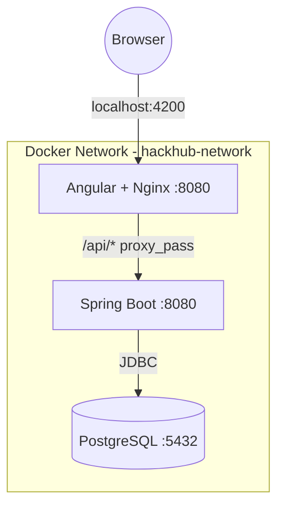
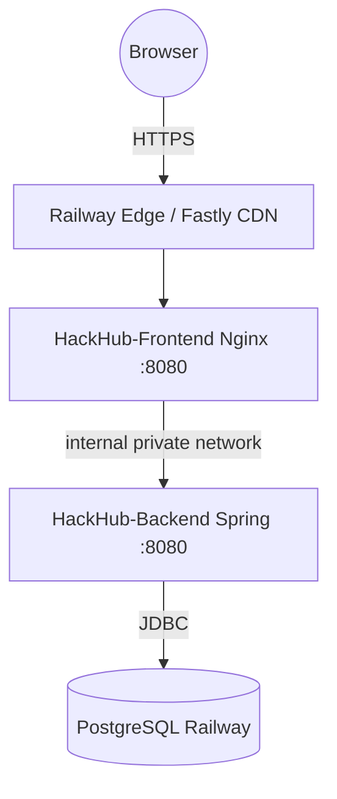
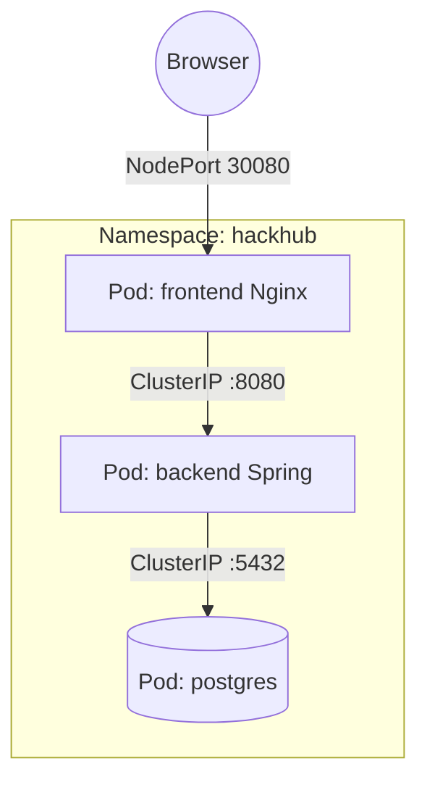
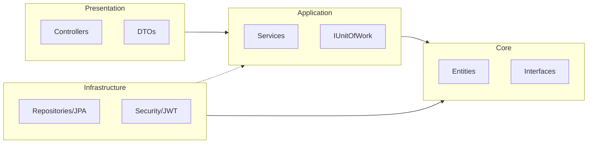

# HackHub

Platform for hackathon management (users, teams, registrations, submissions, invitations, support requests).

## Key Features

- **Authentication**: Registration and login with stateless JWT. Distinct roles: Organizer, Judge, Mentor, Teamless User, Team Leader, Team Member.
- **Hackathon Management**: Creation, automatic state progression (Pending → Open → In Progress → Evaluation → Award → Concluded) via scheduler.
- **Team Management**: Team creation, email invitations, accept/reject, leadership transfer, leave team.
- **Registrations**: Teams can register for hackathons during the open registration phase.
- **Submissions**: Registered teams can submit their project GitHub link during the In Progress phase.
- **Evaluations**: Assigned judges evaluate submissions with a score (0–10) and written feedback.
- **Leaderboard**: Final standings displayed with team scores.
- **Support Requests**: Teams can request mentorship with a proposed call (Google Meet/Webex).
- **Reports**: Teams can report issues to the organizer during the hackathon.
- **PWA**: Installable as a native app, with offline support for previously visited content.

---

## System Architecture

```
                Browser
                  |
                  v
        +---------------------+
        |  Frontend (Angular) |
        |  SPA + Nginx proxy  |
        +----------+----------+
                   |
                   |  /api/*  (proxy → backend)
                   v
        +---------------------+          JDBC
        | Backend (Spring)    |--------------------+
        | REST API :8080      |                    |
        | Swagger/OpenAPI     |                    |
        +----------+----------+                    |
                   |                               |
                   v                               |
        +---------------------+                    |
        | PostgreSQL          |<-------------------+
        | db: hackhub         |
        +---------------------+
```

---

## Deployment Environments

| Environment | Requirements | URL |
| :--- | :--- | :--- |
| **Docker Compose** (local development) | Docker Desktop | `http://localhost:4200` |
| **Local without Docker** | Java 21, Node 20, PostgreSQL | `http://localhost:4200` |
| **Railway** (cloud) | Railway account | `https://hackhub-frontend-production.up.railway.app` |
| **Kubernetes / Minikube** (local) | Docker Desktop, Minikube, kubectl | `minikube service frontend -n hackhub` |

---

## Running with Docker Compose

The easiest way to start the full stack locally.

### Prerequisites

- [Docker Desktop](https://www.docker.com/products/docker-desktop/)
- `.env` file in the root directory (use `.env.example.env` as a template)

### Initial Setup

```bash
cp .env.example.env .env
```

Default values ready for local development:

```env
JWT_SECRET=change-this-key-in-production-minimum-64-characters-required!!
JWT_EXPIRATION=86400000
DB_URL=jdbc:postgresql://postgres:5432/hackhub
DB_USERNAME=hackhub
DB_PASSWORD=hackhub
```

In production, replace at least `JWT_SECRET` with a secure random string (minimum 64 characters).

> The frontend is available at `http://localhost:4200` (Compose maps host port 4200 → Nginx container port 8080).

### Start/Stop

```bash
# Start the full stack (with image build)
docker compose up --build -d

# Container status
docker compose ps

# Stop and remove containers
docker compose down
```

---

## Local Development without Docker

Run services separately during development.

### Backend (Spring Boot)

Requires an active PostgreSQL instance (you can use `docker compose up postgres -d`).

```bash
cd Codice/app
./mvnw spring-boot:run
```

The backend will be available at `http://localhost:8080`.

### Frontend (Angular)

```bash
cd Codice/frontend
npm install
npm start
```

The frontend will be available at `http://localhost:4200` with automatic proxy to the backend (`proxy.conf.json`).

---

## Deploy on Railway (Cloud)

The app is deployed on [Railway](https://railway.app) with three separate services: PostgreSQL, Backend, and Frontend.

### Public URLs

- **Frontend**: `https://hackhub-frontend-production.up.railway.app`
- **Backend**: `https://hackhub-backend-production.up.railway.app`

### Service Configuration

**Backend** — Root Directory: `Codice/app`, Dockerfile: `Codice/app/Dockerfile`, port `8080`

| Variable | Value |
| :--- | :--- |
| `SPRING_PROFILES_ACTIVE` | `dev` |
| `DB_URL` | `jdbc:postgresql://${{Postgres.PGHOST}}:5432/${{Postgres.PGDATABASE}}` |
| `DB_USERNAME` | `${{Postgres.PGUSER}}` |
| `DB_PASSWORD` | `${{Postgres.PGPASSWORD}}` |
| `JWT_SECRET` | random string ≥ 64 characters |
| `JWT_EXPIRATION` | `86400000` |
| `ALLOWED_ORIGINS` | Railway frontend public URL |

**Frontend** — Root Directory: `Codice/frontend`, Dockerfile: `Codice/frontend/Dockerfile`, port `8080`

| Variable | Value |
| :--- | :--- |
| `BACKEND_URL` | `http://<backend-name>.railway.internal:8080` |

> The backend private hostname can be found in Railway → HackHub-Backend → Settings → Networking → Private Networking.

### Notes
- The frontend communicates with the backend via the Railway **internal private network**, not the public URL.
- `ALLOWED_ORIGINS` must exactly match the frontend URL (with `https://`, no trailing slash).

---

## Deploy on Kubernetes (Minikube)

Manifests are in [k8s/](k8s/) and allow running the app on local Kubernetes.

### Prerequisites

- [Docker Desktop](https://www.docker.com/products/docker-desktop/)
- [Minikube](https://minikube.sigs.k8s.io/docs/start/) — `winget install Kubernetes.minikube`
- kubectl (included with Docker Desktop)

### Startup

```powershell
# 1. Start the cluster
minikube start --driver=docker

# 2. Point Docker at Minikube's registry
minikube docker-env | Invoke-Expression

# 3. Build images inside the cluster
docker build -t hackhub-backend:latest ./Codice/app
docker build -t hackhub-frontend:latest ./Codice/frontend

# 4. Create the secrets file (NOT included in the repository)
cp k8s/02-secrets.example.yaml k8s/02-secrets.yaml
# Edit k8s/02-secrets.yaml and set DB_PASSWORD and JWT_SECRET

# 5. Apply manifests
kubectl apply -f k8s/

# 6. Open the app in the browser
minikube service frontend -n hackhub
```

### Manifest Structure

```
k8s/
├── 01-namespace.yaml         # "hackhub" namespace
├── 02-secrets.example.yaml   # Credentials template (copy to 02-secrets.yaml and fill in)
├── 02-secrets.yaml           # DB password and JWT secret — NOT in git
├── 03-configmap.yaml         # Configuration variables
├── 04-postgres.yaml          # PostgreSQL StatefulSet + PVC + Service
├── 05-backend.yaml           # Backend Deployment + Service
└── 06-frontend.yaml          # Frontend Deployment + NodePort Service
```

### Useful Commands

```powershell
# Pod status
kubectl get pods -n hackhub

# Logs for a pod
kubectl logs -n hackhub <pod-name>

# Stop the cluster
minikube stop

# Delete everything
kubectl delete namespace hackhub
```

---

## Running Tests

### Backend Tests

Unit tests cover the main services (AuthService, HackathonService, TeamService) using JUnit 5 + Mockito.

```bash
cd Codice/app
./mvnw test
```

For the coverage report (JaCoCo):

```bash
./mvnw verify
```

Report available at `Codice/app/target/site/jacoco/index.html`.

### Frontend Tests

Unit tests cover core services, guards, interceptors, and directives using Karma + Jasmine.

```bash
cd Codice/frontend
npm test
```

---

## Swagger / OpenAPI

The backend exposes interactive API documentation.

- **Swagger UI**: `http://localhost:8080/swagger-ui/index.html`
- **OpenAPI JSON**: `http://localhost:8080/v3/api-docs`

---

## Test Credentials

These users are automatically seeded by `DataSeeder` on startup if the database is empty. The password for all accounts is **`Test1234!`**.

| Name | Email | Role |
| :--- | :--- | :--- |
| Mario Rossi | `mario@hackhub.it` | ORGANIZZATORE |
| Luigi Verdi | `luigi@hackhub.it` | ORGANIZZATORE |
| Giovanni Bianchi | `giudice@hackhub.it` | GIUDICE |
| Paolo Gialli | `mentore@hackhub.it` | MENTORE |
| Francesca Viola | `utente1@hackhub.it` | UTENTE_SENZA_TEAM |
| Matteo Rosso | `utente2@hackhub.it` | UTENTE_SENZA_TEAM |

---

## Roles & Permissions Matrix

Roles are assigned automatically by the system based on user actions. `UTENTE_SENZA_TEAM` → `LEADER_TEAM` on team creation; → `MEMBRO_TEAM` on invitation acceptance; `LEADER_TEAM` → `MEMBRO_TEAM` on leadership transfer.

| Action | ORGANIZZATORE | GIUDICE | MENTORE | LEADER_TEAM | MEMBRO_TEAM | UTENTE_SENZA_TEAM |
| :--- | :---: | :---: | :---: | :---: | :---: | :---: |
| Create a hackathon | ✅ | ❌ | ❌ | ❌ | ❌ | ❌ |
| Advance hackathon state (manual) | ✅ | ❌ | ❌ | ❌ | ❌ | ❌ |
| Assign judges / mentors | ✅ | ❌ | ❌ | ❌ | ❌ | ❌ |
| Declare winning team | ✅ | ❌ | ❌ | ❌ | ❌ | ❌ |
| Evaluate a submission | ❌ | ✅ (assigned only) | ❌ | ❌ | ❌ | ❌ |
| Create a team | ❌ | ❌ | ❌ | ❌ | ❌ | ✅ |
| Invite members to the team | ❌ | ❌ | ❌ | ✅ | ❌ | ❌ |
| Accept / reject an invitation | ❌ | ❌ | ❌ | ❌ | ❌ | ✅ |
| Transfer leadership | ❌ | ❌ | ❌ | ✅ | ❌ | ❌ |
| Leave the team | ❌ | ❌ | ❌ | ✅ (only if sole member) | ✅ | ❌ |
| Register team for a hackathon | ❌ | ❌ | ❌ | ✅ | ❌ | ❌ |
| Submit project (GitHub link) | ❌ | ❌ | ❌ | ✅ | ✅ | ❌ |
| Request support from a mentor | ❌ | ❌ | ❌ | ✅ | ✅ | ❌ |
| Respond to a support request | ❌ | ❌ | ✅ (assigned only) | ❌ | ❌ | ❌ |
| Send a report | ❌ | ❌ | ❌ | ✅ | ✅ | ❌ |
| View the leaderboard | ✅ | ✅ | ✅ | ✅ | ✅ | ✅ |
| View own hackathons / teams | ✅ | ✅ | ✅ | ✅ | ✅ | ✅ |

---

## Main REST Endpoints

Base path: `/api`

### Auth
- `POST /auth/register`
- `POST /auth/login`
- `POST /auth/logout`

### Users
- `GET /users/me`
- `PUT /users/me`
- `GET /users/by-role/{role}` — `role ∈ {ORGANIZZATORE, GIUDICE, MENTORE}`

### Hackathons
- `GET /hackathons`
- `GET /hackathons/{hackathonId}`
- `POST /hackathons`
- `GET /hackathons/my`
- `GET /hackathons/judge/my`
- `GET /hackathons/mentor/my`
- `PATCH /hackathons/{hackathonId}/status`
- `GET /hackathons/{hackathonId}/classifica`
- `GET /hackathons/{hackathonId}/participants`
- `POST /hackathons/{hackathonId}/join?teamId=...`
- `POST /hackathons/{hackathonId}/winner?teamId=...`

### Teams
- `POST /teams`
- `PUT /teams/{teamId}`
- `DELETE /teams/{teamId}/members/me`
- `PATCH /teams/{teamId}/leader/{newLeaderId}`
- `GET /teams/my-teams`
- `GET /teams/{teamId}`
- `POST /teams/cleanup`

### Invitations
- `POST /invitations`
- `PATCH /invitations/{id}`
- `GET /invitations/received`
- `GET /invitations/sent`

### Submissions
- `POST /submissions`
- `PATCH /submissions/{id}`
- `PATCH /submissions/{id}/evaluation`
- `GET /submissions/my-submissions`
- `GET /submissions/hackathon/{idHackathon}`

### Support Requests
- `POST /support-requests`
- `GET /support-requests?hackathonId=...`
- `PATCH /support-requests/{id}/call`
- `GET /support-requests/proposte-call?hackathonId=...&teamId=...`

### Reports
- `POST /segnalazioni`
- `GET /segnalazioni?hackathonId=...`

---

## Design & Architecture Decisions

HackHub adopts a **Clean Architecture** split into 4 layers:

1. **Core**: Business entities (POJOs) and fundamental interfaces. No dependencies on other layers.
2. **Application**: Business logic, services, and repository interfaces (IUnitOfWork).
3. **Infrastructure**: Technology implementations (JPA, Security, Database).
4. **Presentation**: REST API exposure via Spring Boot controllers.

### Patterns & Technologies

- **Unit of Work**: Coordinates multiple repositories in atomic transactions.
- **Builder Pattern**: Used for `Hackathon` entity creation (many required fields).
- **Strategy Pattern**: External link validation (GitHub, LinkedIn, etc.) — extendable without modifying existing logic.
- **JWT Stateless**: Stateless API for optimal horizontal scalability.
- **BCrypt**: Password hashing with built-in salt, resistant to brute-force and rainbow table attacks.
- **Angular PWA**: Service Worker for caching and offline support.
- **PwaService (SRP)**: "Add to Home Screen" installation logic encapsulated in a dedicated service.
- **Angular Lazy Loading**: Feature modules loaded on demand to optimise the initial bundle.

---

## 12-Factor App Compliance

| Factor | Status | Notes |
| :--- | :---: | :--- |
| I. Codebase | ✅ | Single GitHub repository for the entire project. |
| II. Dependencies | ✅ | Explicitly declared in `pom.xml` and `package.json`. |
| III. Config | ✅ | Configuration loaded from environment variables (`.env`, Railway, K8s ConfigMap/Secret). |
| IV. Backing services | ✅ | PostgreSQL treated as an external resource connected via JDBC. |
| V. Build, release, run | ✅ | CI/CD pipeline separates build (Docker images) from release and run. |
| VI. Processes | ✅ | Stateless backend thanks to JWT tokens. |
| VII. Port binding | ✅ | Services expose port 8080 (backend) and port 8080 (frontend Nginx). |
| VIII. Concurrency | ✅ | Horizontal scalability via Docker/K8s replicas. |
| IX. Disposability | ✅ | Fast startup and graceful shutdown with Alpine images. |
| X. Dev/prod parity | ✅ | Same Docker stack used locally, on Railway, and on Kubernetes. |
| XI. Logs | ✅ | Logs as event streams on stdout/stderr. |
| XII. Admin processes | ✅ | DataSeeder runs in the same operational environment. |
| XIII. API First | ✅ | REST APIs documented with Swagger/OpenAPI. |
| XIV. Telemetry | ✅ | Spring Boot Actuator for health checks and monitoring. |
| XV. Security | ✅ | JWT authentication and Spring Security on every endpoint. |

---

## Progressive Web App (PWA)

HackHub is installable as a native app on mobile and desktop devices.

- **Offline Support**: Previously visited sections of the app are accessible without a connection.
- **Install Banner**: Personalised installation prompt shown when criteria are met.
- **Smart Cache**: *Freshness* strategy — attempts the network first, falls back to cache.

### Testing the PWA Locally

The Service Worker is not active with `ng serve`. To test it:

```bash
cd Codice/frontend
npm run build -- --configuration production
npx http-server dist/frontend -p 4200
```

Open `http://localhost:4200` in Chrome and check `DevTools → Application → Service Workers`.

---

## Diagrams

### Deployment Diagram — Docker Compose (local)


```mermaid
graph TD
    User((Browser)) -->|localhost:4200| Frontend

    subgraph Docker Network - hackhub-network
        Frontend[Angular + Nginx :8080]
        Backend[Spring Boot :8080]
        DB[(PostgreSQL :5432)]
    end

    Frontend -->|/api/* proxy_pass| Backend
    Backend -->|JDBC| DB
```

### Deployment Diagram — Railway (cloud)


```mermaid
graph TD
    User((Browser)) -->|HTTPS| Edge[Railway Edge / Fastly CDN]
    Edge --> Frontend[HackHub-Frontend Nginx :8080]
    Frontend -->|internal private network| Backend[HackHub-Backend Spring :8080]
    Backend -->|JDBC| DB[(PostgreSQL Railway)]
```

### Deployment Diagram — Kubernetes / Minikube


```mermaid
graph TD
    User((Browser)) -->|NodePort 30080| Frontend[Pod: frontend Nginx]
    Frontend -->|ClusterIP :8080| Backend[Pod: backend Spring]
    Backend -->|ClusterIP :5432| DB[(Pod: postgres)]

    subgraph Namespace: hackhub
        Frontend
        Backend
        DB
    end
```

### Backend Architecture


```mermaid
graph LR
    subgraph Presentation
        C[Controllers]
        D[DTOs]
    end
    subgraph Application
        S[Services]
        U[IUnitOfWork]
    end
    subgraph Core
        E[Entities]
        I[Interfaces]
    end
    subgraph Infrastructure
        R[Repositories/JPA]
        SEC[Security/JWT]
    end

    Presentation --> Application
    Application --> Core
    Infrastructure --> Core
    Infrastructure -.-> Application
```

---

## CI/CD Pipeline

The project includes a CI/CD pipeline via **GitHub Actions**:

- **Continuous Integration**: On every push or PR to `main`, Maven (backend) and npm (frontend) builds and tests are executed.
- **Continuous Deployment**: On push to `main`, the pipeline builds Docker images and publishes them to the GitHub Container Registry (GHCR).

Configuration: [.github/workflows/ci.yml](.github/workflows/ci.yml)
